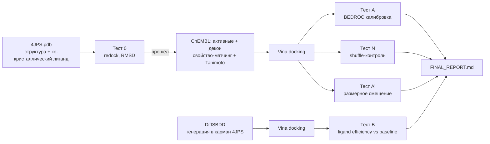

# onco-target-explorer — PIK3CA pilot

[](LICENSE)


Пилотный, воспроизводимый прогон: докинг-калибровка (BEDROC) на PIK3CA
(структура 4JPS) + генерация кандидатов через DiffSBDD, оба этапа с
предрегистрированным протоколом и контролями.



## О проекте

Цель мишени -- PIK3CA: часто мутирован при раке молочной железы, есть
одобренный препарат (алпелисиб) и богатые данные активности в ChEMBL --
то есть мишень, на которой метод докинг-скрининга можно проверить, а не
только слепо применить.

**Главный тезис проекта: задача не в том, чтобы сгенерировать молекулы, а
в том, чтобы доказать, что оценке этих молекул (докинг-скору) можно
доверять**, прежде чем на основе неё что-либо ранжировать или
рекомендовать. Отсюда порядок этапов: сначала калибровка на известных
активных/неактивных (Тест A) и контроли, что метрика не врёт (Тест N) и
не подменяет "связывание" простым "размером молекулы" (Тест A'), и
только потом -- генерация новых кандидатов (Тест B).

## Результаты

*(таблица обновляется автоматически по мере прохождения этапов; текущее
состояние -- см. [STATUS.md](STATUS.md), финальная сводка появится в
[FINAL_REPORT.md](FINAL_REPORT.md) по завершении).*

| Тест | Метрика | Порог | Результат | Вердикт |
|---|---|---|---|---|
| Тест 0 (redock) | RMSD | ≤ 2.0 A | **0.705 A** | ✅ ПРОЙДЕН |
| Тест A (калибровка) | BEDROC(α=20) | ≥ 0.20 | считается | — |
| Тест N (shuffle-контроль) | BEDROC вокруг случайного уровня | — | считается | — |
| Тест A' (размерное смещение) | R² скор~тяжёлые атомы | ≤ 0.5 | считается | — |
| Тест B (DiffSBDD vs baseline) | LE, 10-й перцентиль, перестановочный p | — | считается | — |

## Установка и запуск

```bash
conda env create -f environment.yml -n pik3ca-pilot
conda activate pik3ca-pilot
pip install -r requirements.txt

# полный пайплайн (идемпотентен, можно перезапускать)
python src/common/orchestrate.py

# только Тест 0 (быстрая проверка, ~1 минута)
python src/04_docking/test0_redock.py
```

Воспроизведение на маленьком наборе (20 лигандов) -- см.
`results/pilot_smoke/README.md`.

## Структура репозитория

```
config/           protocol.yaml (пороги, предрегистрация) + paths.yaml
src/
  01_data_curation/   ChEMBL-курация активных/декоев
  02_receptor_prep/   подготовка рецептора (переиспользует
                       gene_target_utils.py / dock_existing_candidates.py
                       из корня репозитория, см. их README)
  03_ligand_prep/     подготовка лигандов (там же)
  04_docking/         Vina-докинг, Тест 0
  05_metrics/         BEDROC/AUC/enrichment, дисперсия Vina
  06_generation/       Тест B (DiffSBDD)
  common/             оркестратор, state/control, обезличивание
results/          выходы каждого теста + графики
docs/             методология, ограничения, диагностика, план масштабирования
```

Корневые `.py`-файлы (`gene_target_utils.py`, `dock_existing_candidates.py`,
`module5_admet_filters.py` и др.) -- более ранняя часть проекта
(мутационный анализ, druggability, ADMET/SA-score фильтры, MolGPT/
REINVENT4/DiffSBDD эксперименты), переиспользуемая пилотом напрямую, не
переписана в `src/` заново.

## Честно

Это пилотный прогон на одной рабочей станции (i7 13-го поколения, RTX A4000,
Windows) за ограниченное время, не финальное исследование. Протокол
зафиксирован тегом `preregistration` до получения результатов. Полный
список упрощений и отклонений -- [docs/limitations.md](docs/limitations.md).
Что не успело посчитаться к дедлайну -- см. `FINAL_REPORT.md`.

## Дальше

Архитектура рассчитана на перенос на кластер Аль-Фараби без переписывания
логики -- см. [docs/scale-up.md](docs/scale-up.md).
